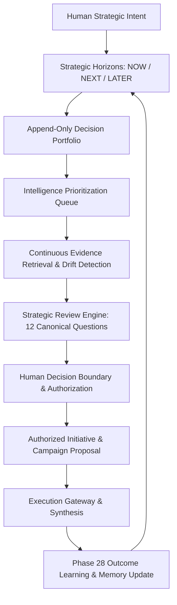

<div align="center">
  <h1>⚜️ MERCER AI</h1>
  <p><strong>Enterprise Visual Intelligence & Institutional Strategic Operations Platform for Luxury Fashion.</strong></p>
  <p>Merging physical textile DNA analysis, cinematic generative synthesis, and multi-horizon institutional decision intelligence.</p>

  <!-- Badges -->
  <p>
    
    
    
    
    
    
  </p>

  <p>
    📚 <strong>Complete Architecture & Research Documentation:</strong> <a href="https://github.com/Subhamcode16/MERCER-DOCS">MERCER-DOCS Knowledge Base</a>
  </p>
</div>

---

## 🌪 The Problem

Modern luxury fashion houses face an acute operational dilemma:
1. **Physical Production Overhead**: Orchestrating global high-fashion campaigns requires weeks of location logistics, expensive physical shoots, and complex staging.
2. **Generic AI Aesthetic Drift**: Off-the-shelf generative AI models lack material fidelity (fabric drape, specular micro-weave, anisotropic sheen) and suffer from severe aesthetic drift.
3. **Disconnected Strategy vs Execution**: Strategic creative decisions are disconnected from rapid campaign generation, resulting in ungrounded marketing experiments and resource waste.

---

## ⚡️ The Solution

**MERCER AI** solves this through a unified 30-layer architectural fabric connecting physical textile intelligence to executive institutional strategy:

- **Textile DNA Extraction**: Precise physical specular, weave, and drape extraction from raw garment captures.
- **Cinematic Generative Fabric**: Multi-model waterfall routing with strict brand archetypes and lighting physics.
- **Institutional Intelligence Layer (Phase 30)**: Strategic Horizons (`NOW`, `NEXT`, `LATER`, `FUTURE`, `UNKNOWN`), Append-Only Decision Portfolios, Continuous Drift Detection, and 14-Class Organizational Memory.

---

## 🏗 High-Level Architectural Hierarchy

```text
Institutional Strategy & Strategic Operations (Phase 30)
                ↓
Organizational Decision Intelligence (Phase 29)
                ↓
Campaign Intelligence & Outcome Learning (Phase 28)
                ↓
Creative Intelligence Network (Phase 27)
                ↓
Visual DNA / Product / Brand Knowledge
                ↓
Creative Workforce & Scoped Workers
                ↓
Production Fabric & Render Engine
```

---

## 🌊 Core Operating Loop



---

## ✨ System Capabilities

| Subsystem | Scope | Highlights |
|---|---|---|
| **Textile DNA Vision Core** | Visual Intelligence | Micro-weave analysis, lighting simulation, drape physics |
| **Studio Workspace UI** | Next.js 16 App Router | Dark-mode canvas, digital human turntable, asset lineage diff |
| **Decision Portfolio Engine** | Backend / Phase 30 | Dynamic attention scoring: `Impact × Urgency × Uncertainty × Reversibility` |
| **Assumption & Drift Monitor** | Institutional Layer | Automated staleness scanning, contradiction preservation, anti-poisoning |
| **14-Class Memory Ledger** | Governance Substrate | SHA-256 hash-chained append-only memory with tamper detection |
| **Security Substrate** | Enterprise Hardening | Full mitigation against 35 security threat vectors (`T30-001`–`T30-035`) |

---

## 🔐 Security & Governance Invariants

- **Intelligence ≠ Authorization**: AI agents synthesize, monitor, and draft; only authenticated humans approve.
- **Separation of Decision Quality vs Outcome Quality**: High-uncertainty decisions evaluated on epistemic rigor, not hindsight bias.
- **Unknown State Survival**: `UNKNOWN` is a first-class state that cannot be coerced into false certainty.
- **Multi-Tenant Partitioning**: Strict tenant isolation with automated semantic leakage scrubbing.

---

## 🧪 Test Suite & Formal Verification

MERCER AI features a comprehensive, multi-layer automated test suite:

```powershell
# Run the complete Phase 30 test suite
cd Visual-Intelligence/product/backend
.venv\Scripts\python.exe run_phase30_tests.py
```

```text
======================== 81 passed in 9.52s ========================
- 35/35 Security Threat Tests (T30-001 to T30-035)
- 6/6 Core Integration Workflows (A through F)
- 30-Step Canonical Lifecycle Verification
- 12-Cycle Long-Horizon Simulation under Market Shocks
- Multi-Tenant Isolation & Invalidation Verification
```

---

## 🚀 Quick Start Guide

### 1. Prerequisites
- **Python**: `3.13`
- **Node.js**: `v18.0+`
- **MongoDB Atlas** / **Google AI Studio Key**

### 2. Startup (One-Click)
```powershell
# From the project root
.\start-app.bat
```

### 3. Manual Start
**Backend:**
```bash
cd Visual-Intelligence/product/backend
python -m venv .venv
.venv\Scripts\activate
pip install -r requirements.txt
uvicorn main:app --reload --port 8000
```

**Frontend:**
```bash
cd Visual-Intelligence/product/frontend
npm install
npm run dev
```

---

## 📂 Codebase Layout

```text
MERCER-AI/
├── Visual-Intelligence/
│   ├── product/
│   │   ├── backend/
│   │   │   ├── src/
│   │   │   │   ├── institutional_intelligence/  # Phase 30 Strategic Operations Layer
│   │   │   │   ├── creative_intelligence_network/ # Phase 29 Foresight & Graph
│   │   │   │   ├── studio_operations/           # Production orchestrators
│   │   │   │   └── security_substrate/          # Core auth & isolation
│   │   │   ├── tests/                           # 81+ automated verification suites
│   │   │   └── run_phase30_tests.py             # Test execution entrypoint
│   │   └── frontend/
│   │       ├── src/app/                         # Next.js 16 App Router pages
│   │       └── src/components/                  # Studio, Turntable, HUD components
├── start-app.bat                                # Unified startup launcher
└── README.md                                    # Project overview
```

---

## ⚖️ License & Attribution

Open-Source under **All Rights Reserved**. © 2026 MERCER AI Team.
Developed with Google DeepMind Antigravity Advanced Agentic Engineering.
