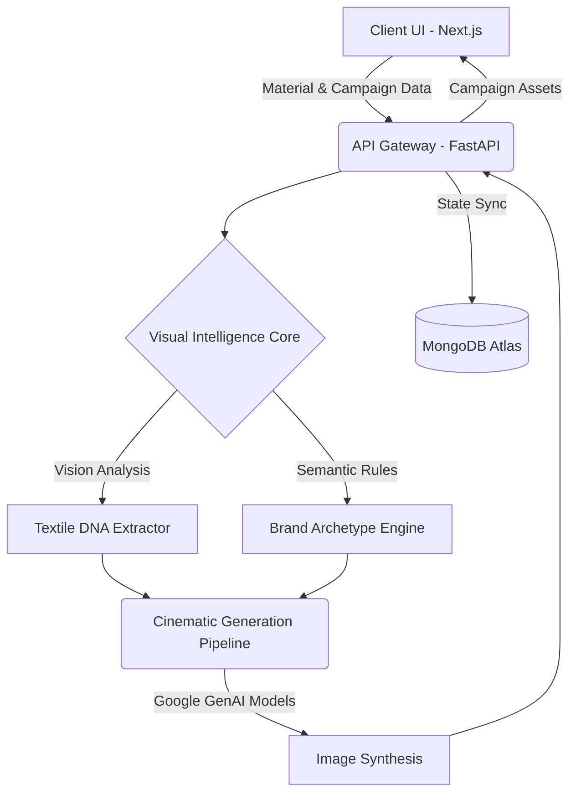

<div align="center">
  
  <h1>MERCER AI</h1>
  <p><strong>The Visual Intelligence Engine for Luxury Fashion.</strong></p>
  <p>Merging textile DNA analysis with cinematic image generation to orchestrate hyper-realistic, brand-aligned fashion campaigns.</p>

  <!-- Badges -->
  <p>
    
    
    
    
  </p>
</div>

---

## 🌪 The Problem

Modern fashion brands face an impossible bottleneck: producing high-end, editorial-quality campaigns requires massive budgets, complex logistics, and weeks of post-production. On the flip side, generic AI generation tools lack the strict material accuracy (drape, texture, light interaction) and brand-archetype control required by luxury standards.

**The result:** Brands are forced to choose between exorbitant physical production costs or low-fidelity, off-brand AI slop.

## ⚡️ The Solution

**MERCER AI** bridges the gap. It is an end-to-end visual campaign studio designed specifically for the fashion industry. 

The core innovation is **Textile DNA Analysis**: by uploading physical material specimens, MERCER AI extracts the true weave type, fiber base, and specular properties. It then injects this "DNA" into our generation pipeline—enforcing strict brand archetypes and cinematic lighting logic—yielding hyper-realistic, editorial assets that remain ruthlessly faithful to the original garment.

---

## 🌊 How It Works

1. **Upload Material Specimen**: Feed your raw fabric or garment photos into the intelligence engine.
2. **Extract Textile DNA**: The system analyzes weave, drape, light-scatter, and physical constraints.
3. **Configure Art Direction**: Define the environment (e.g., *Nighttime Palace*, *Editorial Studio*), cinematic lighting, and model pose.
4. **Enforce Brand Archetype**: Select strict styling rails (e.g., *Minimalist Heritage*, *Dark Tech*).
5. **Generate & Orchestrate**: Render hyper-realistic campaign assets at scale.

---

## 🏗 System Architecture



### Component Roster

| Name | Role | Location | Description |
|---|---|---|---|
| **Next.js Studio UI** | Frontend | `/frontend` | The React-based campaign studio interface with luxury styling. |
| **FastAPI Core** | Backend | `/backend` | The high-performance Python server orchestrating AI pipelines. |
| **Generative Models** | AI Engine | Cloud | Powered by Google Gemini 2.5 Flash/Pro and advanced diffusion networks. |
| **Auth Provider** | Identity | `/frontend` | Supabase/OAuth secure identity and role management. |

---

## ✨ Core Features

- **Campaign Studio Workspace**: A comprehensive, dark-mode bento-grid workspace to organize, track, and direct ongoing visual campaigns.
- **Material Intelligence Engine**: Advanced OCR and vision reasoning to lock onto true physical material properties, ignoring background noise and shadows.
- **Cinematic Lighting & Posing**: Granular control over the virtual set—from sharp directional studio flashes to soft, ethereal diffusion.
- **Strict Brand Rails**: Guardrails that prevent generations from drifting into generic aesthetics, maintaining a high-end luxury feel.
- **High-Concurrency Readiness**: Implements aggressive rate-limiting (SlowAPI) and resilient model-waterfall logic (auto-fallback across 2.5-flash to 1.5-pro on exhaustion).

---

## 📦 Prerequisites

| Dependency | Minimum Version | Purpose | Link |
|---|---|---|---|
| **Node.js** | `v18.0+` | Running the Next.js Frontend | [Download](https://nodejs.org/) |
| **Python** | `3.13` | Running the FastAPI Backend | [Download](https://www.python.org/) |
| **MongoDB Atlas** | Cloud | Database for campaigns/users | [Sign Up](https://www.mongodb.com/) |
| **Google AI Studio** | Cloud | API Keys for Generative Models | [Sign Up](https://aistudio.google.com/) |

---

## 🚀 Quick Start Guide

> [!NOTE]
> MERCER AI operates as a decoupled architecture. You will need to start both the frontend and backend servers.

### 1. Clone & Configure

```bash
# 1. Clone the repository
git clone https://github.com/Subhamcode16/MERCER-AI.git
cd MERCER-AI

# 2. Configure Backend Environment
cd Visual-Intelligence/product/backend
cp .env.example .env
# Edit .env with your MongoDB and Google API keys

# 3. Configure Frontend Environment
cd ../frontend
cp .env.example .env.local
# Edit .env.local with your Supabase and API URLs
```

### 2. Start the Services

#### Option A: One-Click Start (Windows)
We provide a unified startup script in the root directory:
```bash
# From the project root
.\start-app.bat
```

#### Option B: Manual Start

**Backend (Terminal 1):**
```bash
cd Visual-Intelligence/product/backend
python -m venv .venv
.venv\Scripts\activate
pip install -r requirements.txt
uvicorn main:app --reload
```

**Frontend (Terminal 2):**
```bash
cd Visual-Intelligence/product/frontend
npm install
npm run dev
```

### 3. Running Services

| Service | Address | Purpose |
|---|---|---|
| **Frontend UI** | `http://localhost:3000` | The primary Campaign Studio interface. |
| **Backend API** | `http://localhost:8000` | API routes and Swagger UI (`/docs`). |

---

## 🔐 Environment Variables

> [!IMPORTANT]
> Never commit your `.env` files. Ensure they are listed in your `.gitignore` across both frontend and backend directories.

### Backend (`/backend/.env`)
| Variable | Required | Description |
|---|---|---|
| `GEMINI_API_KEY` | ✅ | Google AI Studio API key for vision and generation pipelines. |
| `MONGO_URL` | ✅ | MongoDB connection string (e.g., Atlas cluster). |
| `SESSION_SECRET` | ❌ | Encryption key for session handling. |

### Frontend (`/frontend/.env.local`)
| Variable | Required | Description |
|---|---|---|
| `NEXT_PUBLIC_API_URL` | ✅ | URL to the backend (default: `http://localhost:8000`). |
| `NEXT_PUBLIC_SUPABASE_URL` | ✅ | Supabase project URL for authentication. |
| `NEXT_PUBLIC_SUPABASE_ANON_KEY` | ✅ | Supabase anonymous key. |

---

## 📂 Project Structure

```text
MERCER-AI/
├── Visual-Intelligence/
│   ├── product/
│   │   ├── backend/         # FastAPI Server — Handles AI orchestration & DB
│   │   │   ├── main.py      # Entry point for the API
│   │   │   ├── server.py    # Core server logic and rate limiting
│   │   │   └── .env         # Backend secrets (git-ignored)
│   │   └── frontend/        # Next.js 16 Application — Campaign Studio UI
│   │       ├── src/         # React components, pages, and context
│   │       ├── package.json # NPM dependencies (includes security overrides)
│   │       └── .env.local   # Frontend secrets (git-ignored)
├── start-app.bat            # Convenience script for launching both servers
└── README.md                # You are here
```

---

## 🔮 Roadmap

- **Phase 1 (Current)**: Foundational Visual Intelligence & Campaign Studio Workspace.
- **Phase 2**: Multi-Agent refinement (Creative Director Agent + Lighting Agent debating output).
- **Phase 3**: Video synthesis capabilities (Seedance 2.0 integration) for motion campaigns.
- **Phase 4**: Enterprise SaaS multi-tenant licensing and API distribution.

---

## 🤝 Contributing

1. **Fork** the repository.
2. **Create** a feature branch (`git checkout -b feature/editorial-lighting`).
3. **Commit** your changes (`git commit -m 'Add new lighting models'`).
4. **Push** to the branch (`git push origin feature/editorial-lighting`).
5. **Open a Pull Request**.

> [!CAUTION]
> Always verify that your API keys and `.env` files are not staged before committing. Run `git status` carefully.

---

## ⚖️ Disclaimer & License

> [!CAUTION]
> This platform orchestrates generative AI models that may consume significant API quotas. Monitor your usage limits in Google Cloud and MongoDB Atlas to prevent unexpected billing.

Open-Source under **All Rights Reserved**. © 2026 MERCER AI Team.
