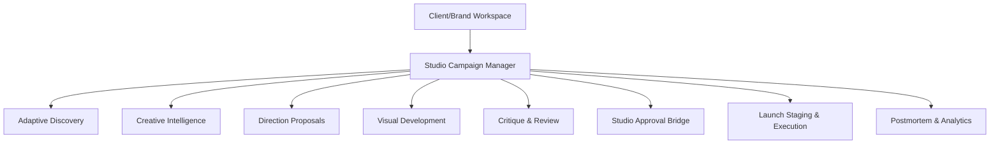

# Phase 27: Campaign Operating System Architecture

## 1. System Architecture Overview
The **Campaign Operating System (COS)** acts as the central command spine that coordinates human intent, workforce intelligence, visual compilation, and multi-channel deployment.

## 2. Optimistic Locking & Version Consistency
Every state transition on a `StudioCampaign` is guarded by an explicit version check:
- Transition requests must supply `expected_version`.
- If `expected_version != campaign.version`, a `CampaignStudioError` (RuntimeError) is raised immediately.
- On successful mutation, `campaign.version` increments by 1.

## 3. Read Model Projections
To preserve sub-millisecond UI rendering speeds without exposing mutative authority:
- Projections are computed via `StateProjectionEngine`.
- DTO payloads are purged of internal secrets and raw CoT traces via `DTOSanitizer.sanitize()`.
- Every projection contains the structural guarantee: `_projection_notice: Projection is a read-only materialized view. Projection ≠ Source of Authority.`
