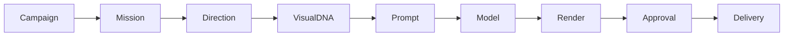

# Phase 27: Cryptographic Multi-Tier Asset Lineage Specification

## 1. 9-Stage Cryptographic Hash Chain
Every creative deliverable published by the Campaign Studio is anchored to a 9-node Merkle-linked provenance graph:

## 2. Mathematical Hash Formula
For node $i$ with type $T_i$, parent ID $P_i$, parent hash $H(P_i)$, and metadata $M_i$:

$$H_i = \mathrm{SHA256}\Big(\mathrm{CanonicalJSON}\big(T_i, P_i, H(P_i), M_i\big)\Big)$$

If any parameter, prompt token, or approval signature is modified after publication, $H_i \neq H_{\text{computed}}$, failing verification instantly.
