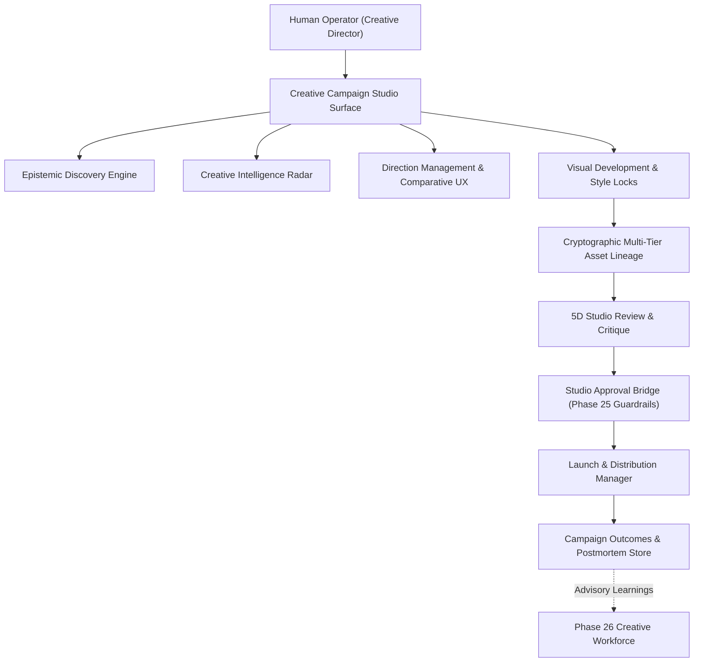

# Phase 27: Executive Product Summary & Campaign Operating System

## 1. Executive Vision
The **ILYREN Creative Campaign Studio** represents the apex human experience and operational command surface for the autonomous creative workforce. Built on the foundational guarantees of the Phase 25 Control Plane and Phase 26 Creative Workforce, Phase 27 provides creative directors, brand executives, and production leads with an intuitive, unified, and mathematically verified campaign operating system.

---

## 2. Core Invariants & Mathematical Guarantees

$$\mathbf{Intelligence \neq Authorization \neq Execution\ Authority \neq Security\ Policy}$$

$$\mathbf{Projection \neq Source\ of\ Authority} \quad \mathbf{Natural\ Language\ Command \neq Permission}$$

$$\mathbf{Attribution \neq Causal\ Proof} \quad \mathbf{Visual\ Similarity \neq Strategic\ Correctness}$$

1. **Intelligence ≠ Authorization**: Autonomous multi-agent reasoning produces recommendations, drafts, and hypotheses. It possesses zero inherent authority to release assets, alter production budgets, or bypass security policies.
2. **Projection ≠ Source of Authority**: Materialized UI views and telemetry dashboards are read-only projections, completely decoupled from authority enforcement.
3. **Natural Language Command ≠ Permission**: Natural language directives and slash commands (`/approve`, `/launch`) are strictly parsed and evaluated against authenticated operator RBAC.
4. **Attribution ≠ Causal Proof**: All post-launch performance metrics are classified as observational/correlational.
5. **Visual Similarity ≠ Strategic Correctness**: Aesthetic alignment is verified against quantitative brand DNA and multi-dimensional critique rubrics.

---

## 3. Product Architecture Highlights
- **Adaptive Epistemic Discovery:** Dynamically tracks domain knowledge across 5 epistemic states (`KNOWN`, `INFERRED`, `MISSING`, `CONFLICTING`, `UNKNOWN`) and generates consequential questions to eliminate ambiguity.
- **Comparative Direction Cards:** Rich visual comparison matrix displaying core idea, narrative angle, audience tension, visual tokens, confidence score, trade-offs, and strategic risks.
- **Cryptographic Multi-Tier Asset Lineage:** Tamper-evident 9-node SHA-256 hash chaining linking Campaign $\rightarrow$ Mission $\rightarrow$ Direction $\rightarrow$ Visual DNA $\rightarrow$ Prompt $\rightarrow$ Model $\rightarrow$ Render $\rightarrow$ Approval $\rightarrow$ Delivery.
- **5-Dimensional Critique Rubric:** Automated critique evaluating Brand Alignment, Aesthetic Fidelity, Emotional Resonance, Technical Execution, and Channel Suitability.
- **Multi-Channel Visual Grammar:** Dynamic adaptation across 1:1 Instagram, 4:5 Lookbook, 9:16 Story/Reel, and 16:9 E-Commerce Hero formats.
