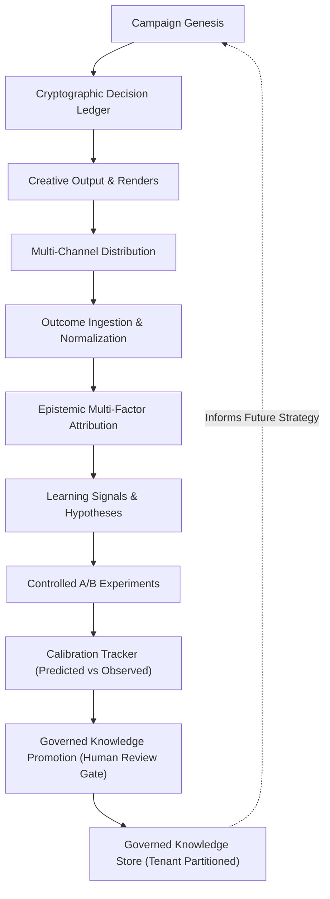

# Phase 28: Executive Operating Loop Summary

## 1. Executive Directive & Architecture
The **ILYREN Creative Intelligence Operating Loop** closes the operational learning loop at the product decision level. It establishes a mathematically governed bridge between what ILYREN believed, what it recommended, what was created, what happened in market distribution, and what can legitimately be learned without allowing learning to mutate authority or policy.

---

## 2. Core Invariants & Mathematical Guarantees

$$\mathbf{Outcome \neq Causation} \quad \mathbf{Correlation \neq Causal\ Proof}$$

$$\mathbf{Learning \neq Policy\ Mutation} \quad \mathbf{Learning \neq Authority}$$

$$\mathbf{Performance \neq Truth} \quad \mathbf{Failure \neq Universal\ Invalidity} \quad \mathbf{Evidence \neq Interpretation}$$

$$\mathbf{Historical\ Record \neq Current\ Recommendation} \quad \mathbf{Optimization \neq Self-Authorization}$$

$$\mathbf{Model\ Confidence \neq Empirical\ Confidence} \quad \mathbf{Institutional\ Learning \neq Cross-Client\ Leakage}$$

$$\mathbf{Unknown\ Must\ Survive}$$

1. **Outcome ≠ Causation / Correlation ≠ Causal Proof:** High conversion or engagement lift cannot be asserted as proof that visual styling caused the outcome.
2. **Learning ≠ Policy Mutation / Learning ≠ Authority:** Performance optimization produces advisory recommendations only. It has zero capability to alter security policies, modify execution privileges, or expand worker authority.
3. **Model Confidence ≠ Empirical Confidence:** Model confidence scores are statistically evaluated against empirical success rates using Expected Calibration Error (ECE).
4. **Institutional Learning ≠ Cross-Client Leakage:** Private client data and brand formulas are strictly quarantined within multi-tenant boundaries.
5. **Unknown Must Survive:** Unobserved counterfactual paths are explicitly declared as `COUNTERFACTUAL_UNKNOWN`. Fabricated counterfactuals are strictly banned.
