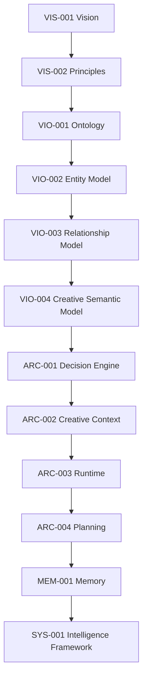

# Architecture Readiness Review (ARR) v1.0

**Date:** 2026-06-30
**Target:** Visual Intelligence Platform (Foundational Architecture)
**Objective:** Guarantee the architecture is theoretically sound, lacks cyclical dependencies, and contains no overlapping abstractions before moving into domain-specific implementation.

---

## Step 1: Repository Audit (Concept Check)

### A. Duplicate Concept Check
- **Context vs Memory:** Resolved by `MEM-001`. Context = Transient State. Memory = Persistent Experience. No overlap.
- **Plans vs State:** Resolved by `ARC-004`. Plans are not a new state container; they are `Verified Plans` inside the Context. No overlap.
- **Agents vs Runtime:** Resolved by `SYS-001` and `ARC-003`. Agents do not exist architecturally. The Runtime orchestrates explicitly bounded `Tasks` owned by `Intelligence Modules`. No overlap.

### B. Dependency Resolution Check
Are all documents pointing to existing, defined abstractions?
- `ARC-003 Runtime` depends on `ARC-002 Context`. (Valid)
- `SYS-001 Intelligence` depends on `ARC-003 Runtime` and `MEM-001 Memory`. (Valid)
- `DNA-00x` will depend on `SYS-001` and `MEM-001`. (Valid)

*Audit Finding: The architectural abstractions are strictly bounded. There are no dangling or undefined concepts (like "Agent" or "Blueprint") remaining in the foundational layer.*

---

## Step 2: Architecture Dependency Graph

The following graph maps the strict dependency flow of the platform's foundation. 

### Graph Analysis
- **Can any arrow disappear?** No. You cannot plan without a runtime, you cannot execute a runtime without a context, you cannot have a context without an ontology.
- **Can any arrow reverse?** No. Reversing Memory into Runtime would cause state corruption. Reversing Planning into Runtime would break the Execution Engine.

*Audit Finding: The dependency graph is perfectly linear from Knowledge (Inside) to Identity (Outside).*

---

## Step 3: Workflow Validations (Pending)

To ensure this graph holds up under pressure, we are drafting four new `VAL` documents:
- `VAL-002`: Luxury Brand Creation
- `VAL-003`: UGC Video
- `VAL-004`: Fashion Photoshoot
- `VAL-005`: Product Launch Campaign

*(See individual `VAL` documents for detailed execution traces).*

---

## Conclusion

The architecture is theoretically sound. Assuming `VAL-002` through `VAL-005` execute successfully without requiring new foundational abstractions, the architecture will be officially marked as **Accepted** and the Architecture Freeze will be enforced.
