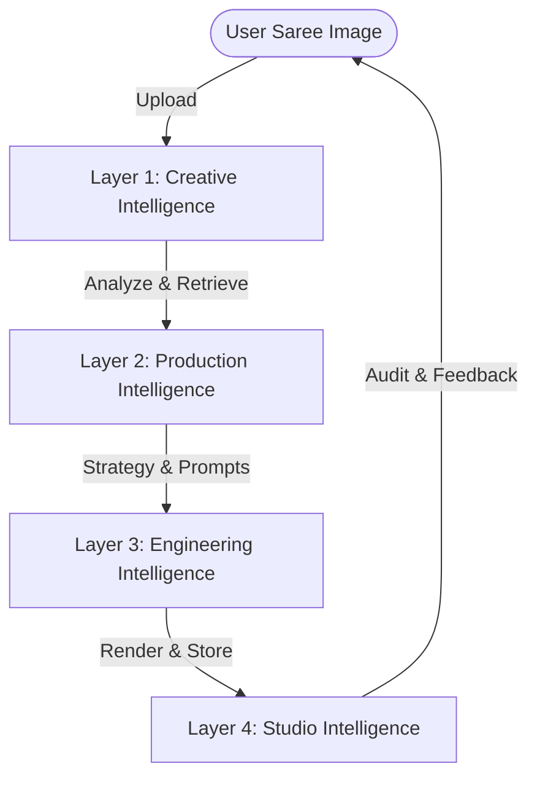

# VAL-001: Textile Workflow Validation

This document simulates the end-to-end execution of the **Mercer AI (Fashion Knowledge DNA)** platform architecture against a real production scenario. By tracing each phase of the **ORRA Loop** (Observe -> Reason -> Remember -> Act), we identify the responsible agents, components, and data schemas to ensure architectural completeness before writing any new code.

---

## 🎭 Scenario Setup
* **Client**: Premium Heritage Handlooms Boutique
* **Garment Input**: A flat lay photo of a **Royal Red Banarasi Silk Saree** with intricate gold zari brocade work on the border and pallu.
* **Goal**: Generate a high-end luxury Instagram campaign themed **"Nocturnal Palace Heritage"**.

---

## 🎬 Creative Studio OS Role Mapping



The workflow is governed by the following Creative Studio OS layers:
* **`creative-director`**: Verifies that the "Nocturnal Palace Heritage" campaign matches the high-end luxury brand positioning (no generic backgrounds or plastic textures).
* **`experience-architect`**: Manages the four emotional stages of the user's scroll (Discovery -> Understanding -> Imagination -> Transformation).
* **`cinematographer`**: Selects the lens (85mm), aperture (f/1.8), and camera body (ARRI Alexa look with fine grain).
* **`lighting-director`**: Directs the dual lighting setup (warm diya firelight casting shadows + cool moonlight rim).
* **`material-director`**: Defines the physical behavior of heavy Banarasi silk (folds, metallic sheen, light absorption/reflection of gold zari).
* **`prompt-engineer`**: Compiles the final LLM-executable prompts, applying negative constraints to prevent artifact styling drift.
* **`backend-engineer`**: Handles database records, JWT checks, credit validation, and job orchestration.

---

## 🔄 The ORRA Loop Step-by-Step Simulation

### 🌐 Ingest / Trigger
The user uploads the flat-lay image of the Saree (`saree_red_banarasi_01.jpg`) and selects the preset vibe "Nocturnal Palace Heritage".
* **Responsible Component**: `CampaignRouter` (`POST /api/campaigns/create`)
* **Responsible Agent**: `backend-engineer`
* **Action**: Create a campaign database entry in MongoDB with status `created`. Check user's credit balance to ensure it is >= 4 credits.

---

### 👁️ Phase 1: OBSERVE
Identify the physical DNA of the garment using visual intelligence.
* **Responsible Component**: `VisionAdapter` (`app/adapters/vision_adapter.py`)
* **Responsible Agent**: `material-director`
* **VLM Prompt Logic**: Inspect weave type, base fabric fiber, weight, sheen, and embroidery patterns.
* **VLM Response (Gemini-2.5-Flash)**:
```json
{
  "material": {
    "value": "Silk",
    "confidence": 0.98
  },
  "weaving_technique": {
    "value": "Banarasi",
    "confidence": 0.97
  },
  "zari_work": {
    "value": "Gold Brocade",
    "confidence": 0.95
  },
  "weight": {
    "value": "Heavy",
    "confidence": 0.92
  }
}
```
* **Validation Check**: All confidence metrics are $> 0.85$. The UI displays the verified characteristics green indicator. (If any were $< 0.85$, the field would be highlighted in yellow for user review).

---

### 🧠 Phase 2: REASON
Query the knowledge vault to retrieve drape and lighting rules, then formulate the creative strategy.
* **Responsible Component**: `KnowledgeAdapter` (`app/adapters/knowledge_adapter.py`)
* **Responsible Agent**: `research-curator` & `experience-architect`
* **Action**: Execute GraphRAG traversal in `graph.json`. Start from the "Banarasi" and "Silk" nodes:
  1. Retrieve [Silk.md](file:///c:/Users/User/OneDrive/Desktop/Fashion%20Knowldge%20Wiki/obsidian-vault/Silk.md): Load drape properties (high drapability, high reflectivity).
  2. Retrieve [Specialty_Fabrics.md](file:///c:/Users/User/OneDrive/Desktop/Fashion%20Knowldge%20Wiki/obsidian-vault/Specialty_Fabrics.md): Load physical constraint parameters (heavy weight, metallic zari sheen, temple border borders).
  3. Load [SDB-001-studio-environment-database.md](file:///c:/Users/User/OneDrive/Desktop/Fashion%20Knowldge%20Wiki/Visual-Intelligence/knowledge/ontology/SDB-001-studio-environment-database.md): Match environment "Palace Archways" with the selected "Nocturnal" vibe.
* **Orchestration**: `PromptEngine.generate_recommendations()` maps these properties to cinematic variables from [VIO-009-visual-craft.md](file:///c:/Users/User/OneDrive/Desktop/Fashion%20Knowldge%20Wiki/Visual-Intelligence/knowledge/ontology/VIO-009-visual-craft.md):
  * **Camera**: 85mm Lens, f/1.8 Aperture, Eye-Level, cinematic ARRI Look.
  * **Lighting**: Firelight / Nocturne (warm flickering diya firelight + cool moonlight rim).
  * **Composition**: Center-weighted, negative space for editorial copy.
* **State Output**: Write the `creative_state` to MongoDB with status `pending_green_signal`.

---

### 🎬 Phase 3: ACT
Compile final prompts and submit to the live rendering engine after receiving the user's manual approval.
* **User Action**: Clicks "Green Signal" in the UI dashboard.
* **Responsible Component**: `OrraLoop.act()` -> `PromptEngine` & `RenderingEngine`
* **Responsible Agent**: `prompt-engineer` & `backend-engineer`
* **Action**:
  1. Deduct 4 credits from the user's account using `billing.reserve_credits()`.
  2. Compile the LLM-executable prompts for Fal.ai / Flux API:
     * *Prompt*: `"Editorial high-fashion campaign photo. A model of Indian heritage is wearing a premium heavy crimson red Banarasi silk saree with gold zari brocade borders. The saree drapes elegantly with realistic heavy folds. The setting is a majestic nocturnal Rajasthan palace courtyard, framed by carved stone archways. The scene is illuminated by warm flickering oil diyas casting soft shadows, with a subtle cool moonlight rim on the model's hair. Shot on 85mm lens, f/1.8 aperture, cinematic grain, ARRI Alexa style highlight roll-off, desaturated cool tones in the shadows. --ar 4:5 --stylize 700"`
  3. Submit generation job to `RenderingEngine`.
  4. Save returned high-fidelity assets to cloud storage (`AssetStore`) and return the URLs to the database.
  5. Commit credits using `billing.commit_credits()`.

---

### 💾 Phase 4: REMEMBER
Capture user overrides and feedback, saving the session to memory to prevent style or quality drift in future campaigns.
* **User Action**: Inspects generated campaign. Accept images 1, 2, and 4. Reject image 3 with feedback: *"The model looks great, but the background arches are too bright. Increase the shadow depth and dim the moonlight."*
* **Responsible Component**: `HonchoAdapter` (`app/adapters/honcho_adapter.py`)
* **Responsible Agent**: `reviewer-agent` & `experience-architect`
* **Action**:
  - Save the feedback string as a key-value session pair linked to the campaign ID.
  - Append constraint overrides to the user memory graph, ensuring future generations for this campaign lower background ambient exposure by 20%.

---

## 🛡️ Studio Intelligence Final Review

### The Guardians Report
- **Consistency Guardian**: **PASS** — Garment characteristics (red silk + Banarasi brocade) match the input photo across all accepted images. Borders remain uniform.
- **Philosophy Guardian**: **PASS** — Retains heritage values. Avoids synthetic textures or fast-fashion presets.
- **Visual DNA Architect**: **PASS** — 85mm compression and warm diya/cool moon lighting correctly highlight the metallic zari sheen, matching the physical properties in the ontology.

### Final Validation Scores
* **Consistency**: 9.2 / 10
* **Taste**: 9.5 / 10
* **Engineering**: 9.0 / 10
* **Performance**: 8.8 / 10
* **Luxury**: 9.6 / 10
* **Emotion**: 9.4 / 10

**Status**: **APPROVED**
